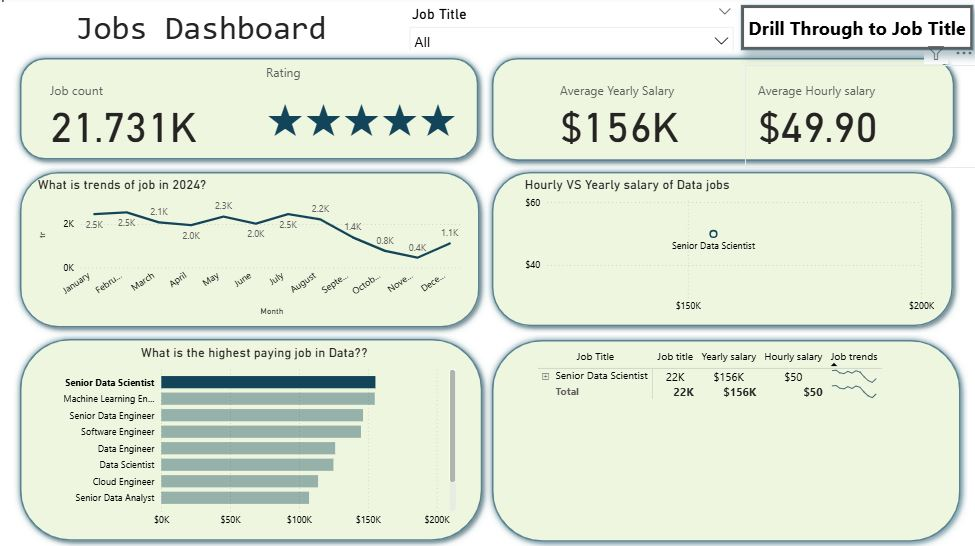
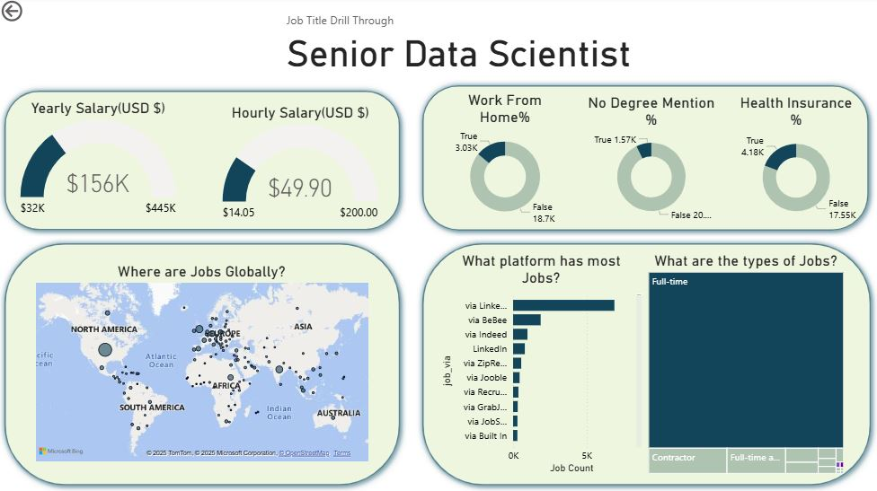

# Data Jobs Dashboard

This project is an interactive Power BI dashboard built to understand **job trends, salary patterns, and demand for different data-related roles in the US job market**.

Using a job trends dataset, the dashboard provides a clear view of how salaries vary across **roles, how job postings change over time**, and how different job titles compare. 

Users can also drill through to explore deeper insights for any specific job title.

### 📌 Page 1 — Main Dashboard

The main page gives an overview of the job market, including total job count, salary insights, ratings, and monthly trends.

Users can select any job title to compare it with others, and use the drill-through option to view detailed information about that role on the next page.

### 📌 Page 2 — Job Title Drill-Through

The drill-through page shows a detailed view of the selected job title, including salary ranges, remote-work availability, degree and insurance information.

It also displays global job locations, top platforms posting the role, and the types of jobs available, giving a clear overview of that specific position.
